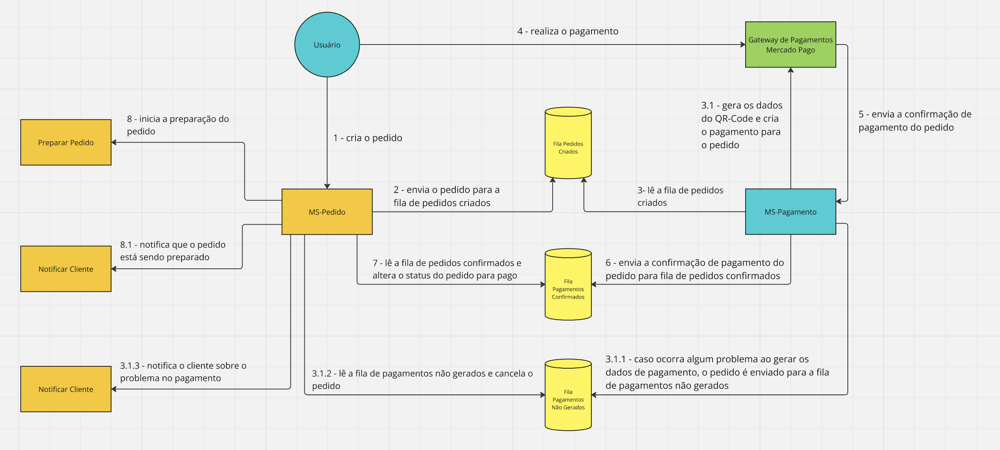

# MS-Pagamento

## SAGA Pattern

Implementamos o padrão SAGA utilizando a abordagem de coreografia.
Como temos apenas dois participantes (MS-Pedido e MS-Pagamento)  da SAGA se comunicando entre si, achamos que não seria necessário uma lógica de coordenação e mais um serviço diferente para dar manutenção.
Caso tivéssemos mais participantes a abordagem de orquestração seria mais adequada, pois ficaria mais difícil rastrear quais participantes escutam determinadas filas e um risco maior de ocorrer dependências cíclicas por conta dos muitos participantes se comunicando entre si.

### **Ação Compensatória**

Quando o cliente cria um pedido automaticamente é criado um pagamento no serviço MS-Pagamento utilizando o serviço de pagamento externo Mercado Pago. Caso MS-Pagamento não consiga se comunicar com o Mercado Pago, será feito 4 novas tentativas. Caso não tenha sucesso será gerada uma ação compensatória para cancelar o pedido e informar o cliente.

